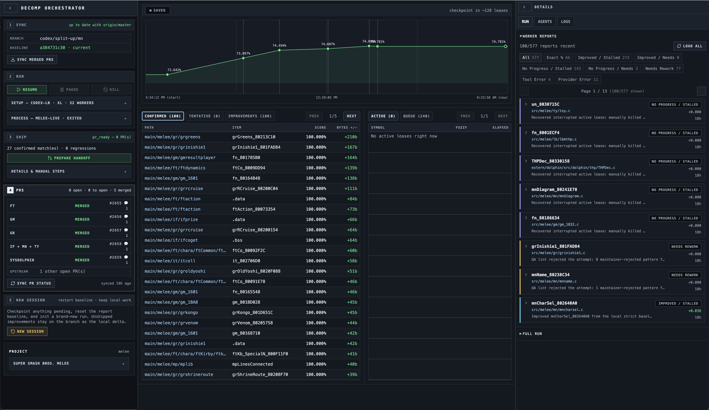

# GameCube Decomp Harness

GameCube Decomp Harness is a Bun/TypeScript workspace for coordinating
high-parallelism decompilation runs. It gives a GameCube decomp game a
durable agent control plane: many Pi worker agents can research, edit, validate,
and report in parallel while sharing one run board, one knowledge graph, and one
set of game-specific safety rails.

The current tracked game is Melee. The harness is organized around
`games/<id>/game.json` descriptors so the same machinery can be pointed at other
GameCube decompilation workspaces. Descriptor resolution is canonical:
`games/<id>/game.json` with optional `games/<id>/local.game.json` overrides.



## What It Does

- Runs director and worker Pi agents against queued decompilation targets.
- Coordinates many workers through SQLite leases, file locks, events, reports,
  and run artifacts instead of agent-to-agent chat.
- Feeds agents from a shared knowledge graph of docs, workflows, tools, past PRs,
  decomp resources, and game-specific facts.
- Keeps long-running cycles inspectable through a dense dashboard with process
  controls, worker reports, queue state, progress panels, and handoff surfaces.
- Wraps validation and handoff flows such as smoke runs, score regression checks,
  PR slice planning, and knowledge refresh.

The intent is not to replace maintainers or game-specific build systems. The
harness automates the repetitive search, edit, validate, and report loop so a
human can supervise progress and review the work that survives validation.

## Quick Start

Install dependencies and run the local checks:

```sh
make install
bun run check
bun run smoke
```

`make install` idempotently registers the sibling Core packages with Bun, then
installs their registered package-name `link:` dependencies.

`bun run smoke` uses dry-run agents and fixture data, so it does not require a
live provider or edit a real decompilation checkout.

Inspect the server job surface:

```sh
bun run server:job -- --game melee status
```

Launch the dashboard when you want the browser control surface:

```sh
bun run ui
```

The dashboard serves at `http://localhost:8787` by default.

## Live Game Setup

The tracked Melee descriptor defaults to `games/melee/checkout/`. For local
work, either place a `doldecomp/melee` checkout there or create ignored
`games/melee/local.game.json` with machine-specific paths for the repo,
state directory, graph database, env file, and process defaults. Legacy
descriptor aliases have been fully removed.

Live agent sessions need:

- Bun, Python 3, and Git.
- A configured GameCube decompilation checkout with its normal build and objdiff
  tooling.
- Pi provider/auth configuration for the selected provider, model, and thinking
  level.
- Game-local secrets in ignored env files such as `games/melee/local.env`.

Keep literal API keys and generated session state out of tracked files.

## Typical Run Shape

Initialize a run:

```sh
bun run server:job -- --game melee init-run \
  --desired-workers 16 \
  --goal-kind matched_code_percent \
  --goal-value 72
```

Run the supervised worker loop:

```sh
bun run server:job -- --game melee --agent-timeout-seconds 14400 babysit \
  --max-workers 16 \
  --idle-sleep-ms 5000 \
  --worker-thinking-level low
```

Before review or handoff, run the regression gate:

```sh
bun run server:job -- --game melee regression-check
```

For high-throughput runs, tune worker count, queue size, candidate windows, graph
ranking, and lease recovery flags from server jobs or the dashboard. The detailed
operational notes live in the docs.

## Repository Map

| Area | Purpose |
| --- | --- |
| `apps/frontend/` | React/Vite dashboard frontend. |
| `apps/server/` | Bun API/static server plus server-owned jobs, process controls, run orchestration, validation, handoff, agents, tools, knowledge, game registry, platform helpers, smoke tests, and fixtures. |
| `../Core/agent-kernel/` | Live Core peer consumed through registered package-name `link:` dependencies; `make install` registers the packages before installing. |
| `../Core/prompt-kit/` | Live Core peer registered by `make install` and consumed through its package-name `link:` dependency. |
| `../Core/docs-system/` | Live Core peer whose docs CLI audits, checks links, and serves this repository's docs. |
| `games/` | Tracked game descriptors plus ignored game-local checkout, state, graph, env, and cycle paths. |
| `knowledge/` | Repo-level references, resources, indexes, graph state, and past-PR corpus. |
| `docs/` | Foundation, system design, implementation details, runbooks, and preserved design artifacts. |

## Docs

- [Docs map](docs/README.md)
- [Evidence refresh cadence](EVIDENCE_REFRESH_CADENCE.md)
- [Foundation overview](docs/00-foundation/00-overview.md)
- [System design overview](docs/10-system-design/00-overview.md)
- [Run director loop](docs/10-system-design/10-run-director-loop.md)
- [Agent model](docs/10-system-design/20-agent-model.md)
- [Process guardians](docs/10-system-design/25-process-guardians.md)
- [Worker lifecycle](docs/10-system-design/40-worker-lifecycle.md)
- [Server job implementation](docs/20-implementation/server-jobs/00-overview.md)
- [UI implementation](docs/20-implementation/ui/00-overview.md)
