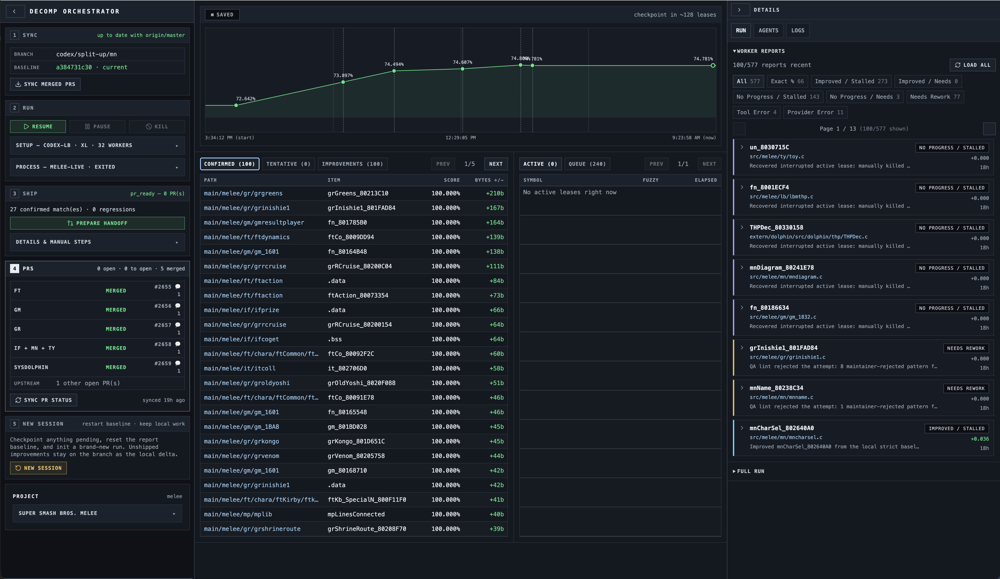

# GameCube Decomp Harness

GameCube Decomp Harness is a Bun/TypeScript workspace for coordinating
high-parallelism decompilation runs. It gives a GameCube decomp game a
durable agent control plane: many Pi worker agents can research, edit, validate,
and report in parallel while sharing one run board, one knowledge graph, and one
set of game-specific safety rails.

The current tracked game is Melee. The harness is organized around
`games/<id>/game.json` descriptors so the same machinery can be pointed at other
GameCube decompilation workspaces. Descriptor resolution is canonical:
`games/<id>/game.json` with optional `games/<id>/config/local.json` overrides.



## What It Does

- Runs director and worker Pi agents against queued decompilation targets.
- Coordinates many workers through SQLite leases, file locks, events, reports,
  and run artifacts instead of agent-to-agent chat.
- Feeds agents from a shared knowledge graph of docs, workflows, tools, past PRs,
  decomp resources, and game-specific facts.
- Keeps continuing runs inspectable through a dense dashboard with process
  controls, worker reports, queue state, progress panels, and handoff surfaces.
- Wraps validation and handoff flows such as smoke runs, score regression checks,
  PR slice planning, and knowledge refresh.

The intent is not to replace maintainers or game-specific build systems. The
harness automates the repetitive search, edit, validate, and report loop so a
human can supervise progress and review the work that survives validation.

## Quick Start

Install dependencies and run the local checks:

```sh
make install
bun run check
bun run smoke
```

`make install` idempotently registers the sibling Core packages with Bun, then
installs their registered package-name `link:` dependencies.

`bun run smoke` uses dry-run agents and fixture data, so it does not require a
live provider or edit a real decompilation checkout.

Run the Bun suites from the repository root:

```sh
bun run test
```

This includes both apps and the toolpack Bun tests. Bare `bun test` and filename
filters search only `apps`, because crawling game workspaces, knowledge corpora,
and vendored examples can exhaust file descriptors. Bun 1.3.10 does not support
test discovery ignore patterns. Python and shell tool tests use their own runners.

For a specific test, prefix its repository-relative path with `./` so Bun opens
that path directly, including tests outside `apps`:

```sh
bun test ./toolpacks/gamecube-decomp/_impl/gamecube/sandbox-image/bundle-plan.test.ts
```

Keep new Bun suites under `apps` or `toolpacks`, or add their directory to the
`test` script. Root-level test files must be passed explicitly as `./file.test.ts`.

Inspect the server job surface:

```sh
bun run server:job -- --game melee status
```

Launch the dashboard when you want the browser control surface:

```sh
bun run ui
```

The dashboard serves at `http://localhost:8787` by default.

## Live Game Setup

Each game has one durable harness state and one canonical host worktree.
Melee uses `games/melee/workspace/checkout`, with its Git common repository
retained at `workspace/repository`. Configuration lives under `config/`,
knowledge under `knowledge/`, and runtime records under `runtime/state/`.
Ignored `games/melee/config/local.json` supplies machine-specific overrides.

Configure the PR, Discord, and wiki sources under `config/sources/`. Initial
Sync captures and indexes required sources and validates the game build.
Validate the selected Daytona sandbox profile before admitting Run. The default
profile is 2-core; a configured 4-core profile remains available.

Live agent sessions need:

- Bun, Python 3, and Git.
- A configured GameCube decompilation checkout with its normal build and objdiff
  tooling.
- Pi provider/auth configuration for the selected provider, model, and thinking
  level.
- Game-local secrets in ignored env files such as `games/melee/config/local.env`.

Keep literal API keys and generated session state out of tracked files.

## Typical Run Shape

Use the dashboard's Run control after initial Sync and sandbox validation.
Run intent and settings survive pauses and server restarts. Each epoch settles
worker output, records a save point, runs Sync, and refreshes report/board truth
before admitting the next epoch. Pause drains work through that boundary.

The API uses `GET /api/harness?gameId=melee` and revision-checked
`POST /api/harness/run` or `POST /api/harness/pause`. Initial/manual Sync uses
`POST /api/sync/start`, followed by validated publication. The operator prompt
is in [RUN_OPERATOR.md](RUN_OPERATOR.md).

## Repository Map

| Area | Purpose |
| --- | --- |
| `apps/frontend/` | React/Vite dashboard frontend. |
| `apps/server/` | Bun API/static server plus server-owned jobs, process controls, run orchestration, validation, handoff, agents, tools, knowledge, game registry, platform helpers, smoke tests, and fixtures. |
| `../Core/agent-kernel/` | Live Core peer consumed through registered package-name `link:` dependencies; `make install` registers the packages before installing. |
| `../Core/prompt-kit/` | Live Core peer registered by `make install` and consumed through its package-name `link:` dependency. |
| `../Core/docs-system/` | Live Core peer whose docs CLI audits, checks links, and serves this repository's docs. |
| `games/` | Grouped per-game configuration, workspaces, knowledge, and runtime records. |
| `runtime/state/` | Shared-service state; game-owned state remains under each game. |
| `docs/` | Foundation, system design, implementation details, runbooks, and preserved design artifacts. |

## Docs

Serve the structured documentation with `bun run docs`. Game setup and the
global file tree are under `10-system-design/10-game`; runtime behavior is under
`10-system-design/20-harness` and `10-system-design/50-workflows`.

These chapters define per-game configuration, Harness State, operations,
timeline boundaries, and the epoch/Sync sequence. External source definitions
and pipeline stages live under `10-system-design/30-knowledge/10-knowledge-sources`.
